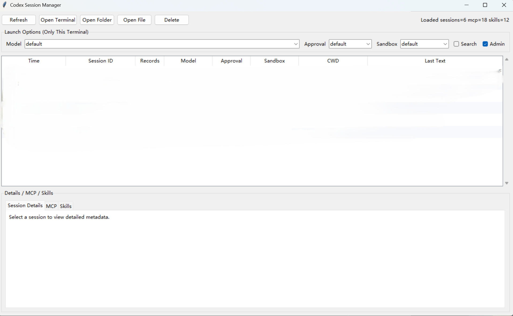

# Codex Session Manager

Desktop and mobile tooling for managing local Codex sessions from Windows, with an optional Android client for phone-first chat control.



## What This Repository Contains
- `app.py`: Windows desktop session manager
- `mobile_portal.py`: local HTTP portal used by browser/mobile clients
- `android-app/`: native Android client project
- `run.bat`: desktop launcher
- `run-mobile.bat`: mobile portal launcher
- `tests/`: backend regression tests
- `assets/`: screenshots and bundled app assets
- `release/`: current packaged artifacts committed to the repo

## What Is Not Committed
Local-only files are ignored on purpose:
- `logs/`
- `.mcp_data/`
- `testchat/`
- temp files such as `tmp_*`
- build caches such as `build/`, `dist/`, `android-app/**/build/`
- shortcuts such as `*.lnk`

## Current Download Options
### Option 1: Use the tracked release files
If you clone this repository, the current packaged files in `release/` come down with it:
- `release/codex-session-manager-windows-x64.zip`
- `release/codex-mobile-debug.apk`
- `release/tailscale-setup-1.94.2.exe`
- `release/tailscale-android-universal-1.94.2.apk`

### Option 2: Use GitHub Releases
Historical versions should be downloaded from GitHub Releases instead of from git history.

## Quick Start
### Use the Windows deployment zip
1. Extract `release/codex-session-manager-windows-x64.zip`.
2. For desktop-only use, run `run.bat`.
3. For phone access, run `run-mobile.bat`.
4. Install `release/codex-mobile-debug.apk` onto the phone separately.

### Run the desktop manager
```bat
run.bat
```

### Run the mobile portal
```bat
run-mobile.bat
```

`run-mobile.bat` now self-elevates. If it is started from a normal desktop shell, Windows should prompt for administrator approval automatically. The phone-side portal and any Codex jobs started through it inherit that elevated Windows token.

### Connect the Android app
1. Install `release/codex-mobile-debug.apk`.
2. Start `run-mobile.bat` on the PC.
3. Copy the full URL printed in the terminal.
4. Paste it into the Android app.

## Desktop Manager
The desktop manager is for session browsing and local launch control.

Main features:
- browse saved Codex sessions
- inspect model, approval, sandbox, CWD, notes, MCP, and Skills
- open a selected session in terminal
- open the session working directory or history file
- delete local sessions
- create a new session with launch settings

## Mobile Portal
The mobile portal is the backend used by the browser/mobile flows.

It supports:
- browsing sessions from the phone
- continuing a session with real `codex exec resume`
- creating a new session from a chosen folder
- viewing MCP and Skills
- session notes
- reply-stop control
- reply status monitoring

Keep `run-mobile.bat` open while the phone is connected.

## Controlled Browser Attach
This repository now includes fixed-port helpers for the two supported controlled browsers:

- `C:\Users\MECHREVO\Desktop\启动受控Edge.cmd` -> `http://127.0.0.1:9222`
- `C:\Users\MECHREVO\Desktop\启动代理Chrome.cmd` -> `http://127.0.0.1:9223`

Supported workflow:

1. Start one of the controlled-browser launchers.
2. Log in to the target site manually in that browser.
3. Inspect the already logged-in browser instance later from the project.

Quick verification examples:

```powershell
python -c "import mobile_portal; print(mobile_portal.describe_controlled_browser_attach('edge', hostname='dash.cloudflare.com'))"
python -c "import mobile_portal; print(mobile_portal.describe_controlled_browser_attach('chrome', hostname='github.com'))"
```

Current limitation:

- only the two controlled browsers on `9222` and `9223` are supported
- arbitrary user-opened browsers are not supported

## Controlled Browser Actions
The project also exposes browser-control APIs through `mobile_portal.py` for the same two controlled browsers.

Available routes:

- `GET /api/browser/attach`
- `POST /api/browser/info`
- `POST /api/browser/html`
- `POST /api/browser/navigate`
- `POST /api/browser/evaluate`
- `POST /api/browser/click`
- `POST /api/browser/type`
- `POST /api/browser/press`
- `POST /api/browser/wait-text`

Example attach request:

```text
/api/browser/attach?browser=edge&hostname=dash.cloudflare.com&token=...
```

Example Python verification:

```powershell
python -c "import mobile_portal; svc = mobile_portal.PortalService('127.0.0.1', 8765, 'token'); print(svc.browser_attach_payload('edge', hostname='dash.cloudflare.com'))"
```

Dependency note:

- real browser actions require the `websocket-client` Python package
- if it is missing, browser action calls fail with a direct error telling you to install it

## Android App
The Android app is a native chat-style client for the local portal.

Supported behavior:
- session list with replying highlight
- native chat view
- top/bottom jump buttons and fast scroll
- unsent text and selected-image draft restore
- local notification when a reply completes
- stop current reply
- create new chat with folder browsing

## Cross-Network Use
You can expose the mobile portal either through Tailscale or through a public reverse-proxy entry such as Cloudflare Tunnel.

### Option 1: Tailscale
Use this when the phone and PC are not on the same Wi-Fi.

1. Install Tailscale on the PC and phone.
   - PC installer in this repo: `release/tailscale-setup-1.94.2.exe`
   - Android installer in this repo: `release/tailscale-android-universal-1.94.2.apk`
2. Sign in with the same account or tailnet.
3. Start `run-mobile.bat`.
4. Use the printed `Tailscale (cross-network)` URL in the Android app.

### Option 2: Cloudflare Tunnel or another public URL
If you already have a public hostname that forwards to the portal, add it to:

- `%USERPROFILE%\\.codex\\mobile_portal_settings.json`

Example:

```json
{
  "proxy_enabled": true,
  "proxy_port": 7897,
  "public_urls": [
    "https://chat.example.com"
  ]
}
```

Notes:
- store the base URL only; the portal adds the current `?token=...` automatically
- you can list more than one public URL
- `run-mobile.bat` will print a `Public (Cloudflare/custom)` section when this is configured
- the browser portal homepage also shows these entry links in the header

If neither Tailscale nor a public URL is configured, the launcher still prints LAN URLs for same-network use.

## Clone And Run From Source
```powershell
git clone https://github.com/penguin-oo/codex-session-manager-windows.git
cd codex-session-manager-windows
```

Desktop UI:
```bat
run.bat
```

Mobile portal:
```bat
run-mobile.bat
```

Android project:
```powershell
cd android-app
```

## Source Requirements
### Desktop / portal
- Windows
- Python 3.11+
- Tkinter included in the standard Python installer
- `codex` available in `PATH`

### Built-in token pool
- Python package: `requests`
- token files stored in `C:\Users\<YourUser>\.cli-proxy-api\`
- each token file must be a `.json` file and contain one of:
  - `access_token`
  - `token`
  - `api_key`

### Python environment selection for the built-in token pool
The desktop manager and mobile portal start with your normal Python launcher.

The built-in token pool proxy uses this startup order:
1. if `conda` exists and the `codex-accel` environment exists, it starts with `conda run -n codex-accel python ...`
2. otherwise it falls back to the current/default Python that launched `mobile_portal.py`

This means:
- `codex-accel` is optional
- a separate virtual environment is not required
- on machines without `codex-accel`, the built-in token pool still works as long as the current Python is 3.11+ and has `requests`

Recommended one-line install on a fresh machine:
```powershell
python -m pip install requests
```

### Android
- Android Studio or compatible Gradle/SDK setup if you want to build the APK yourself

## Build Notes
### Windows desktop zip
The packaged Windows zip is built from:
- `dist/codex-session-manager.exe`
- `run.bat`
- `run-mobile.bat`
- `mobile_portal.py`
- `README.md`
- `assets/`

This means the Windows zip can be used as a complete PC-side deployment bundle for both:
- the desktop manager
- the mobile portal backend used by the Android app

### Android APK
The tracked APK is the current debug build generated from `android-app/`.

## Recommended GitHub Layout
- keep source and docs in git
- keep only the current packaged artifacts in `release/`
- use GitHub Releases for historical versions

## Troubleshooting
### Mobile app cannot connect
- confirm `run-mobile.bat` is still running
- use the exact URL including `?token=...`
- if using Tailscale, confirm both devices are connected to the same tailnet

### Built-in token pool proxy did not become ready
Check these in order:
- make sure the machine is using the latest code from this repository
- confirm Python is `3.11+`
- run `python -m pip install requests`
- confirm token files exist in `C:\Users\<YourUser>\.cli-proxy-api\`
- if `conda` is installed but `codex-accel` is not, that is now supported; the launcher should fall back automatically
- if it still fails, restart `run-mobile.bat` and read the new error text carefully, because startup errors are now surfaced directly instead of only showing a generic timeout

### How to ensure the highest practical Windows privilege
- For phone-driven chats:
  - start `run-mobile.bat`
  - accept the UAC prompt
  - this gives the portal and its child Codex jobs administrator / high-integrity rights
- For desktop-opened chat windows:
  - keep `Admin` checked in the desktop manager before clicking `Open Terminal`
  - Windows will prompt for elevation for that specific terminal window
- If you want the desktop manager process itself elevated too:
  - right-click `run.bat`
  - choose `Run as administrator`
- This project does not elevate to `SYSTEM` or `TrustedInstaller`; the supported top level is normal Windows administrator / high integrity

### PowerShell `Invoke-WebRequest` security prompt
- That prompt is not caused by missing administrator rights
- It appears when a PowerShell command uses `Invoke-WebRequest` without safer parsing flags
- Prefer:
  - `curl.exe ...`
  - or `Invoke-WebRequest ... -UseBasicParsing`
- Raising Windows privilege does not suppress this prompt by itself

### Desktop manager opens slowly
- restart the desktop manager after upgrades
- avoid selecting ignored temp/test folders as working directories

### New chat seems stuck
The app should now enter the chat page as soon as the new session id exists, instead of waiting for the entire first reply to finish.
